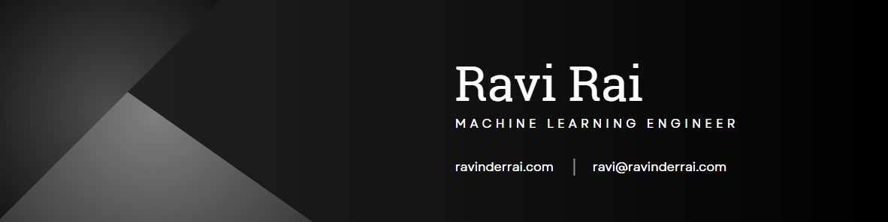

  
  &#8287;&#8287;&#8287;&#8287;&#8287;
  
  &#8287;&#8287;&#8287;&#8287;&#8287;
  
  &#8287;&#8287;&#8287;&#8287;&#8287;

 

  
Hi 👋, I'm **Ravinder** (but I go by **Ravi** normally). I'm a physicist and mathematician turned data scientist/machine learning engineer. I love to engage and join new communities so feel free to reach out!

  
🧑 More about me

- 🚀 Background in quantum computing

- 🤖 Have been studying machine learning on the side throughout my years in research

- 🌱 Currently immersing myself in NLP and MLOps

- 👨‍💻 Most active on LinkedIn, check me out there: [RaviBRai](https://www.linkedin.com/in/ravibrai/)
  

