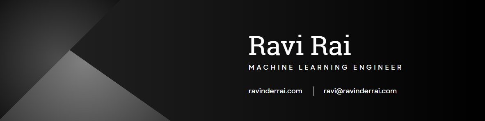

  
  &#8287;&#8287;&#8287;&#8287;&#8287;
  
  &#8287;&#8287;&#8287;&#8287;&#8287;
  
  &#8287;&#8287;&#8287;&#8287;&#8287;

 

  
Hi 👋, I'm **Ravinder** (but I go by **Ravi** normally). I'm a typical physicist turned ML/AI Engineer, and since school I ended up going down the freelance route.

  
🔧 What I Do

- Background in quantum computing.

- Focus is on traditional ML alongside LLM Engineering.

- Currently sharpening adjacent skills like frontend development.

- Also Blog on the side about my learnings in ML and things I've built.

- Even dabble in indie hacking - you'll see repos for those apps here (except for the ones that actually take off, hopefully one day maybe soon probably not). 
  

